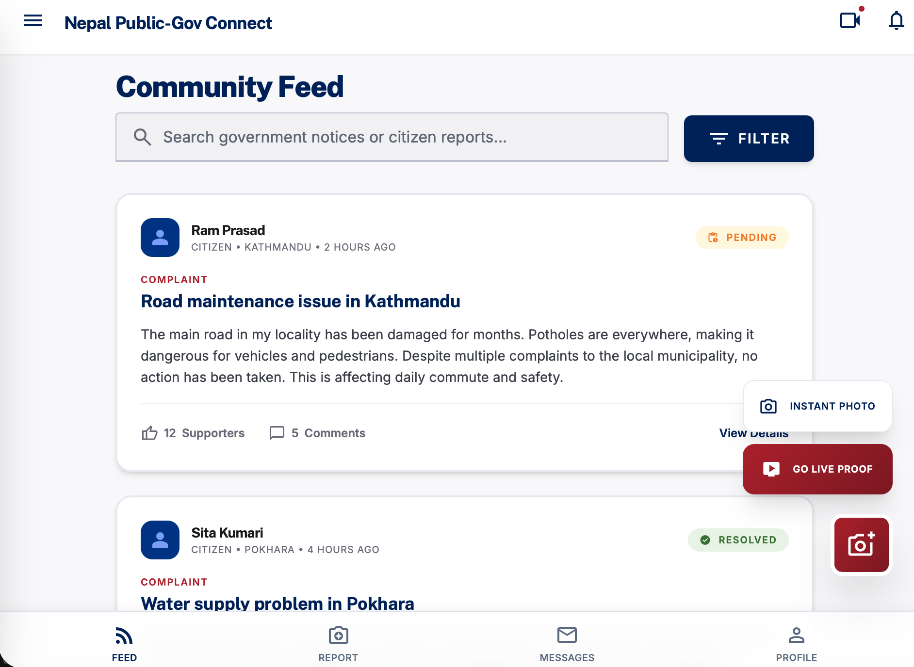
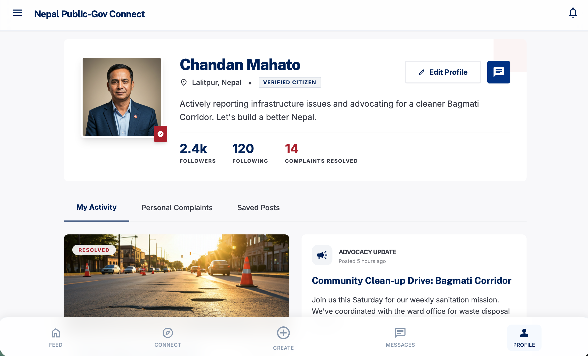

# 🇳🇵 Nepal Public Gov Connect

A modern digital platform that bridges the gap between **citizens and government authorities** by enabling real-time reporting, tracking, and resolution of public issues.

---

## 🚀 Features

- 📝 Submit complaints with detailed descriptions
- 📸 Upload photo/video proof (instant evidence)
- 📍 Location-based issue reporting
- 👥 Community feed with public complaints
- 👍 Support & comment on issues
- 🔔 Real-time status updates (Pending / Resolved)
- 👤 User profiles with activity tracking
- 🏛️ Government interaction & transparency

---

## 🖥️ Screenshots

### 📌 Community Feed


### 👤 User Profile


### 📝 Submit Complaint


---

## 🛠️ Tech Stack

- **Frontend:** HTML, CSS, JavaScript / React (if used)
- **Backend:** Django
- **Database:** SQLite / PostgreSQL
- **Other:** REST API, Authentication

---

## ⚙️ Installation

```bash
# Clone the repository
git clone https://github.com/Cngh10/Nepal_gov_connect.git

# Navigate into project
cd Nepal_gov_connect

# Create virtual environment
python -m venv venv

# Activate environment
source venv/bin/activate   # Mac/Linux
venv\Scripts\activate      # Windows

# Install dependencies
pip install -r requirements.txt

# Run migrations
python manage.py migrate

# Start server
python manage.py runserver
